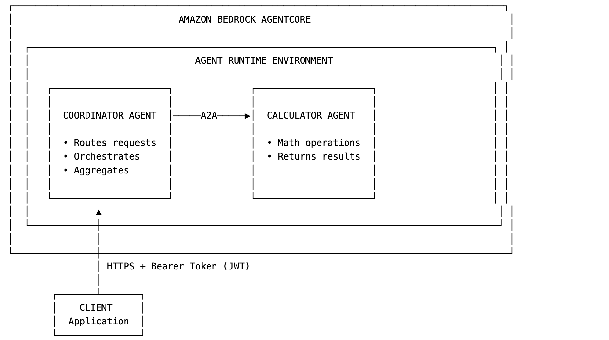

# Amazon Bedrock AgentCore A2A Protocol Guide

Amazon Bedrock AgentCore Runtime introduces the A2A (Agent-to-Agent) protocol, enabling AI agents to communicate, collaborate, and delegate tasks to each other using a standardized JSON-RPC 2.0 contract. This guide explains how to implement A2A servers that allow multiple AI agents to discover each other, share capabilities, and work together on complex workflows of multi-agent systems in AWS.

## Table of Contents

- [What is A2A Protocol?](#what-is-a2a-protocol)
- [Key Components](#key-components)
- [A2A Message Format](#a2a-message-format)
- [Agent Card Structure](#agent-card-structure)
- [Protocol Comparison](#protocol-comparison)
- [Architecture Overview](#architecture-overview)
- [Building Your First A2A Agent](#building-your-first-a2a-agent)
- [Building a Coordinator Agent](#building-a-coordinator-agent)
- [Testing A2A Communication](#testing-a2a-communication)
- [Common Errors and Fixes](#common-errors-and-fixes)

## What is A2A Protocol?

The Agent-to-Agent (A2A) protocol is an open standard that defines how AI agents discover, communicate, and collaborate with each other. It provides a standardized way for agents to:

- Discover other agents and their capabilities
- Communicate using a common message format
- Delegate tasks to specialized agents
- Collaborate on complex workflows

## Key Components

| Component | Description |
|-----------|-------------|
| JSON-RPC 2.0 | Transport protocol for standardized request/response |
| Agent Card | Metadata document describing agent capabilities |
| Message Format | Structured format for agent communication |
| Skills | Advertised capabilities that agents can perform |

## A2A Message Format

A2A uses JSON-RPC 2.0 for communication:

```json
{
  "jsonrpc": "2.0",
  "method": "message/send",
  "id": "request-123",
  "params": {
    "message": {
      "kind": "message",
      "role": "user",
      "messageId": "msg-456",
      "parts": [
        {
          "kind": "text",
          "text": "Calculate 384 * 35"
        }
      ]
    }
  }
}
```

## Agent Card Structure

Every A2A server exposes an Agent Card at `/.well-known/agent-card.json`:

```json
{
  "name": "Calculator Agent",
  "description": "Performs mathematical operations",
  "version": "1.0.0",
  "protocolVersion": "0.3.0",
  "preferredTransport": "JSONRPC",
  "url": "https://agent-endpoint/invocations/",
  "capabilities": {
    "streaming": true
  },
  "defaultInputModes": ["text"],
  "defaultOutputModes": ["text"],
  "skills": [
    {
      "id": "calculator",
      "name": "Calculator",
      "description": "Performs arithmetic operations"
    }
  ]
}
```

## Protocol Comparison

Amazon Bedrock AgentCore provides a managed runtime environment for deploying and running A2A servers with enterprise-grade features. The protocol and ports for A2A are slightly different compared to MCP and HTTP protocols used in Bedrock AgentCore.

| Protocol | Port | Path | Use Case |
|----------|------|------|----------|
| HTTP | 8080 | /invocations | General HTTP APIs |
| MCP | 8000 | /mcp | Model Context Protocol |
| A2A | 9000 | / | Agent-to-Agent communication |

## Architecture Overview

This guide provides step-by-step instructions for setting up inter-agent coordination between a **COORDINATOR AGENT** and a **CALCULATOR AGENT** using the A2A protocol. The Coordinator Agent serves as the decision-maker, routing requests to the appropriate tool based on the input received.



## Building Your First A2A Agent

Let's build a Calculator Agent that performs mathematical operations.

### Prerequisites

```bash
# Install required packages
pip install strands-agents[a2a]
pip install bedrock-agentcore
pip install strands-agents-tools
```

### Project Structure

```
calculator_agent/
├── calculator_agent.py           # Main agent code
├── requirements.txt              # Dependencies
└── .bedrock_agentcore.yaml       # Deployment config (auto-generated)
```

### Calculator Agent Code

**Create `calculator_agent.py`:**

```python
import logging
import os
from strands_tools.calculator import calculator
from strands import Agent
from strands.multiagent.a2a import A2AServer
import uvicorn
from fastapi import FastAPI

logging.basicConfig(level=logging.INFO)
logger = logging.getLogger(__name__)

# Get runtime URL from environment (set by AgentCore)
runtime_url = os.environ.get('AGENTCORE_RUNTIME_URL', 'http://127.0.0.1:9000/')
logger.info(f"Runtime URL: {runtime_url}")

# Create the Strands agent with calculator tool
strands_agent = Agent(
    name="Calculator Agent",
    description="A calculator agent that performs basic arithmetic operations.",
    tools=[calculator],
    callback_handler=None
)

# A2A server configuration
host, port = "0.0.0.0", 9000

# Create A2A server wrapping the agent
a2a_server = A2AServer(
    agent=strands_agent,
    http_url=runtime_url,
    serve_at_root=True  # Mount at root path
)

# FastAPI application
app = FastAPI()

@app.get("/ping")
def ping():
    """Health check endpoint required by AgentCore."""
    return {"status": "healthy"}

# Mount A2A server at root
app.mount("/", a2a_server.to_fastapi_app())

if __name__ == "__main__":
    uvicorn.run(app, host=host, port=port)
```

### Requirements File

Create a `requirements.txt` file with the following content:

```
strands-agents[a2a]
bedrock-agentcore
strands-agents-tools
```

### Local Testing

**1. Start the server locally:**

```bash
python calculator_agent.py
```

**2. Test health check:**

```bash
curl http://localhost:9000/ping
```

**3. Get agent card:**

```bash
curl http://localhost:9000/.well-known/agent-card.json | jq .
```

**4. Send a calculation request locally:**

```bash
curl -X POST http://localhost:9000/ \
  -H "Content-Type: application/json" \
  -d '{
    "jsonrpc": "2.0",
    "id": "req-001",
    "method": "message/send",
    "params": {
      "message": {
        "role": "user",
        "parts": [{"kind": "text", "text": "what is 101 * 11?"}],
        "messageId": "msg-001"
      }
    }
  }' | jq .
```

### Deploy the Agent Using AgentCore SDK

#### Step 1: Generate Authentication Credentials

Generate `BEARER_TOKEN`, `CLIENT_ID`, and `Discovery URL` using the steps mentioned at:
https://docs.aws.amazon.com/bedrock-agentcore/latest/devguide/runtime-mcp.html#runtime-mcp-appendix

> **Note:** Keep `BEARER_TOKEN`, `CLIENT_ID`, and `Discovery URL` safe as they are needed in later stages.

#### Step 2: Deploy Calculator Agent

1. Run the configuration command:
   ```bash
   agent configure -e calculator_agent.py --protocol A2A
   ```

2. Follow the prompts:
   - When asked **"Configure OAuth authorizer instead?"** → choose **Yes**
     - Enter OAuth discovery URL: Provide the `Discovery URL`
     - Enter allowed OAuth client IDs (comma-separated): Enter the `CLIENT_ID` from Step 1
     - For remaining options, press Enter to accept defaults

3. When asked **"Configure request header allowlist?"** → choose **Yes**
   - Enter allowed request headers (comma-separated): `Authorization,X-Amzn-Bedrock-AgentCore-Runtime-Custom-Session-Id`

4. For all remaining options, choose defaults or press Enter.

#### Step 3: Launch the Agent

Deploy the agent using:

```bash
agentcore launch
```

After deploying the agent, get the Agent Card using the sample code provided in the documentation.

## Building a Coordinator Agent

Now let's build a Coordinator Agent that delegates math problems to our Calculator Agent.

### Coordinator Agent Code

**Create `coordinator_agent.py`:**

```python
import asyncio
import concurrent.futures
import logging
import os
from uuid import uuid4
from contextvars import ContextVar

import httpx
from a2a.client import A2ACardResolver, ClientConfig, ClientFactory
from a2a.types import Message, Part, Role, TextPart
from strands import Agent, tool
from strands.multiagent.a2a import A2AServer
import uvicorn
from fastapi import FastAPI

logging.basicConfig(level=logging.INFO)
logger = logging.getLogger(__name__)

runtime_url = os.environ.get('AGENTCORE_RUNTIME_URL', 'http://127.0.0.1:9000/')
DEFAULT_TIMEOUT = 300

_current_jwt_token: ContextVar[str] = ContextVar('jwt_token', default=None)

def set_jwt_token(token: str):
    _current_jwt_token.set(token)

def get_jwt_token() -> str:
    return _current_jwt_token.get()

def create_message(*, role: Role = Role.user, text: str) -> Message:
    return Message(
        kind="message",
        role=role,
        parts=[Part(TextPart(kind="text", text=text))],
        message_id=uuid4().hex,
    )

def run_async_in_thread(coro):
    """Run async coroutine in a separate thread with its own event loop."""
    with concurrent.futures.ThreadPoolExecutor() as executor:
        future = executor.submit(asyncio.run, coro)
        return future.result()

async def delegate_agent(query: str, agent_name: str, agent_url: str, auth_header: str = None) -> dict:
    """Delegate to the child agent using A2A protocol."""
    try:
        logger.info(f"Starting delegation to {agent_name} at {agent_url}")
        
        if not agent_url:
            logger.error(f"{agent_name}_URL not configured!")
            return {"status": "error", "content": [{"text": f"{agent_name}_URL not configured"}]}

        bearer_token = auth_header if auth_header else f"Bearer {os.environ.get('BEARER_TOKEN')}"
        headers = {"Authorization": bearer_token}

        async with httpx.AsyncClient(timeout=DEFAULT_TIMEOUT, headers=headers) as httpx_client:
            logger.info(f"Resolving agent card from: {agent_url}")
            resolver = A2ACardResolver(httpx_client=httpx_client, base_url=agent_url)
            agent_card = await resolver.get_agent_card()
            logger.info(f"Agent card retrieved successfully")
            
            config = ClientConfig(httpx_client=httpx_client, streaming=False)
            factory = ClientFactory(config)
            client = factory.create(agent_card)

            msg = create_message(text=query)
            logger.info(f"Sending message: {query}")
            
            result = ""
            
            async for event in client.send_message(msg):
                logger.info(f"Received event type: {type(event).__name__}")
                if isinstance(event, Message):
                    for part in event.parts:
                        if hasattr(part, 'text'):
                            result += part.text
                    logger.info(f"Result: {result}")
                    return {"status": "success", "content": [{"text": result}]}
                elif isinstance(event, tuple) and len(event) == 2:
                    task, _ = event
                    if hasattr(task, 'artifacts'):
                        for artifact in task.artifacts:
                            for part in artifact.parts:
                                if hasattr(part.root, 'text'):
                                    result += part.root.text
                    logger.info(f"Result: {result}")
                    return {"status": "success", "content": [{"text": result}]}
                else:
                    return {"status": "success", "content": [{"text": str(event)}]}

    except Exception as e:
        logger.error(f"Delegation to {agent_name} failed: {e}", exc_info=True)
        return {"status": "error", "content": [{"text": f"Error: {str(e)}"}]}


@tool
def math_tool(problem: str) -> dict:
    """Delegate math problems to the calculator agent."""
    agent_url = os.environ.get('CALCULATOR_AGENT_URL')
    logger.info(f"Calculator tool called with problem: {problem}")
    token = get_jwt_token()
    return run_async_in_thread(delegate_agent(problem, "CALCULATOR", agent_url, token))

strands_agent = Agent(
    name="Coordinator",
    description="A coordinator agent that delegates mathematical operations to a specialized calculator agent.",
    system_prompt="""You are a coordinator agent. For any mathematical calculations or arithmetic problems, 
    use the math_tool to delegate to the calculator agent. Always use the tool and present the results clearly.""",
    tools=[math_tool],
    callback_handler=None
)

app = FastAPI()
host, port = "0.0.0.0", 9000

a2a_server = A2AServer(
    agent=strands_agent,
    http_url=runtime_url,
    serve_at_root=True
)

@app.middleware("http")
async def jwt_capture_middleware(request, call_next):
    auth_header = request.headers.get('Authorization')
    if auth_header:
        set_jwt_token(auth_header)
        logger.debug(f"JWT token stored in ContextVar")
    response = await call_next(request)
    return response

@app.get("/ping")
def ping():
    return {"status": "healthy"}

app.mount("/", a2a_server.to_fastapi_app())

if __name__ == "__main__":
    logger.info(f"Starting Coordinator Agent on {host}:{port}")
    uvicorn.run(app, host=host, port=port)
```

### Deploy Coordinator Agent

Repeat the same steps (1-3) for deploying the Coordinator agent.

> **Note:** For the Coordinator agent, ensure you pass the `CALCULATOR_AGENT_URL` during the launch command in Step 3:

```bash
agentcore launch --env "CALCULATOR_AGENT_URL=<calculator_agent_url_here>"
```

The `calculator_agent_url_here` is obtained by following the Get Agent Card script mentioned after Step 3.

## Testing A2A Communication

### Call the Agent Runtime Using BEARER_TOKEN

```bash
agentcore invoke '{
  "jsonrpc": "2.0",
  "method": "message/send",
  "id": "1",
  "params": {
    "message": {
      "kind": "message",
      "role": "user",
      "messageId": "msg-123",
      "parts": [
        {
          "kind": "text",
          "text": "Use the calculator tool to calculate 384*35"
        }
      ]
    }
  }
}' --bearer-token "$BEARER_TOKEN"
```

### Sample Response

```json
{
  "id": "1",
  "jsonrpc": "2.0",
  "result": {
    "artifacts": [
      {
        "artifactId": "a2800dce-0006-4a7b-9161-6879f2ad7925",
        "name": "agent_response",
        "parts": [
          {
            "kind": "text",
            "text": "The result of 384 × 35 is **13,440**.\n"
          }
        ]
      }
    ],
    ```json
    "contextId": "06928184-2534-4818-80a5-4998238ba605",
    "history": [
      {
        "contextId": "06928184-2534-4818-80a5-4998238ba605",
        "kind": "message",
        "messageId": "msg-123",
        "parts": [
          {
            "kind": "text",
            "text": "Use the calculator tool to calculate 384*35"
          }
        ],
        "role": "user",
        "taskId": "646aea10-56a8-4639-b9ac-26efe55dd88d"
      },
      {
        "contextId": "06928184-2534-4818-80a5-4998238ba605",
        "kind": "message",
        "messageId": "218a6b98-f61b-4d96-b885-ff4be7bc6a41",
        "parts": [
          {
            "kind": "text",
            "text": "I'll use"
          }
        ],
        "role": "agent",
        "taskId": "646aea10-56a8-4639-b9ac-26efe55dd88d"
      },
      {
        "contextId": "06928184-2534-4818-80a5-4998238ba605",
        "kind": "message",
        "messageId": "de759bed-0a9e-45e2-88d7-3c352226a215",
        "parts": [
          {
            "kind": "text",
            "text": " the calculator"
          }
        ],
        "role": "agent",
        "taskId": "646aea10-56a8-4639-b9ac-26efe55dd88d"
      },
      {
        "contextId": "06928184-2534-4818-80a5-4998238ba605",
        "kind": "message",
        "messageId": "dea2b1d7-360a-459f-9f53-67b00b453681",
        "parts": [
          {
            "kind": "text",
            "text": " tool to compute"
          }
        ],
        "role": "agent",
        "taskId": "646aea10-56a8-4639-b9ac-26efe55dd88d"
      },
      {
        "contextId": "06928184-2534-4818-80a5-4998238ba605",
        "kind": "message",
        "messageId": "91b6c81e-89a2-4b55-8436-a39215218f73",
        "parts": [
          {
            "kind": "text",
            "text": " 384 ×"
          }
        ],
        "role": "agent",
        "taskId": "646aea10-56a8-4639-b9ac-26efe55dd88d"
      },
      {
        "contextId": "06928184-2534-4818-80a5-4998238ba605",
        "kind": "message",
        "messageId": "bbcb0898-fa5c-4c32-86e4-36e6635a796b",
        "parts": [
          {
            "kind": "text",
            "text": " 35 "
          }
        ],
        "role": "agent",
        "taskId": "646aea10-56a8-4639-b9ac-26efe55dd88d"
      },
      {
        "contextId": "06928184-2534-4818-80a5-4998238ba605",
        "kind": "message",
        "messageId": "f1d15e2f-8fbe-4d5c-8314-2480a92d7acd",
        "parts": [
          {
            "kind": "text",
            "text": "for you."
          }
        ],
        "role": "agent",
        "taskId": "646aea10-56a8-4639-b9ac-26efe55dd88d"
      },
      {
        "contextId": "06928184-2534-4818-80a5-4998238ba605",
        "kind": "message",
        "messageId": "e6cb5f1a-9c82-4898-9fb2-41c03be19299",
        "parts": [
          {
            "kind": "text",
            "text": "The result"
          }
        ],
        "role": "agent",
        "taskId": "646aea10-56a8-4639-b9ac-26efe55dd88d"
      },
      {
        "contextId": "06928184-2534-4818-80a5-4998238ba605",
        "kind": "message",
        "messageId": "ecc42ae8-1192-46c7-a8b1-901d753b8b56",
        "parts": [
          {
            "kind": "text",
            "text": " of 384 × 35 "
          }
        ],
        "role": "agent",
        "taskId": "646aea10-56a8-4639-b9ac-26efe55dd88d"
      },
      {
        "contextId": "06928184-2534-4818-80a5-4998238ba605",
        "kind": "message",
        "messageId": "5381da06-74c9-4aff-85db-236526746772",
        "parts": [
          {
            "kind": "text",
            "text": "is **13,440**."
          }
        ],
        "role": "agent",
        "taskId": "646aea10-56a8-4639-b9ac-26efe55dd88d"
      }
    ],
    "id": "646aea10-56a8-4639-b9ac-26efe55dd88d",
    "kind": "task",
    "status": {
      "state": "completed",
      "timestamp": "2025-12-18T17:48:12.449935+00:00"
    }
  }
}
```

## Common Errors and Fixes

### 401 or 403 Authentication Errors

If you encounter 401 or 403 errors:

1. **401 Errors**: Ensure you are using the `AGENT_URL` that is generated with properly encoded HTML characters.

2. **403 Errors**: Your `BEARER_TOKEN` has likely expired. Refresh the token using the following AWS Cognito command:

```bash
aws cognito-idp initiate-auth \
  --region us-east-1 \
  --client-id <YOUR_CLIENT_ID> \
  --auth-flow USER_PASSWORD_AUTH \
  --auth-parameters 'USERNAME=<your_username>,PASSWORD="<your_password>"' \
  --query 'AuthenticationResult.AccessToken' \
  --output text
```

Replace the placeholders:
- `<YOUR_CLIENT_ID>` with your actual Client ID
- `<your_username>` with your Cognito username
- `<your_password>` with your Cognito password

### Connection Timeout Errors

If you experience connection timeouts:

- Verify that the `CALCULATOR_AGENT_URL` is correctly set in the Coordinator Agent environment variables
- Check that both agents are deployed and running
- Ensure network connectivity between agents

### Agent Card Not Found

If the agent card cannot be retrieved:

- Verify the agent URL is correct and accessible
- Check that the agent is properly deployed and the health check endpoint (`/ping`) responds
- Ensure the `/.well-known/agent-card.json` endpoint is accessible

### Tool Execution Failures

If the math tool fails to execute:

- Check the Coordinator Agent logs for delegation errors
- Verify the JWT token is being properly captured and forwarded
- Ensure the Calculator Agent is accepting requests with the provided authentication

## Best Practices

1. **Security**
   - Always use OAuth authentication in production
   - Rotate bearer tokens regularly
   - Store credentials securely using AWS Secrets Manager

2. **Monitoring**
   - Enable CloudWatch logging for all agents
   - Monitor agent health check endpoints
   - Track delegation latency and success rates

3. **Error Handling**
   - Implement proper timeout handling (default: 300 seconds)
   - Add retry logic for transient failures
   - Log all delegation attempts for debugging

4. **Testing**
   - Test agents locally before deployment
   - Validate agent cards are properly formatted
   - Test end-to-end workflows with sample requests

## Additional Resources

- [Amazon Bedrock AgentCore Documentation](https://docs.aws.amazon.com/bedrock-agentcore/)
- [A2A Protocol Specification](https://github.com/google/a2a)
- [Strands Agents Documentation](https://strandsagents.com/latest/)
- [JSON-RPC 2.0 Specification](https://www.jsonrpc.org/specification)

## Support

For issues and questions:
- AWS Support Console for production issues
- GitHub Issues for open-source components
- AWS Developer Forums for community support

---

**License:** This guide is provided as-is for educational purposes. Please refer to AWS service terms for production usage.
